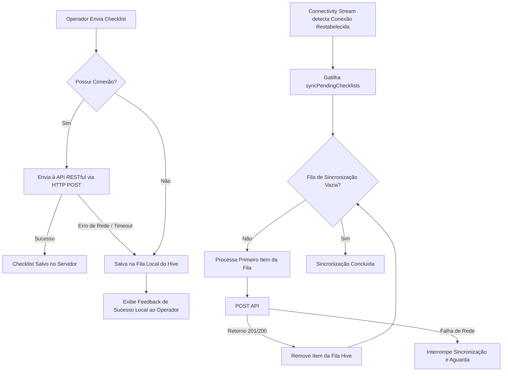
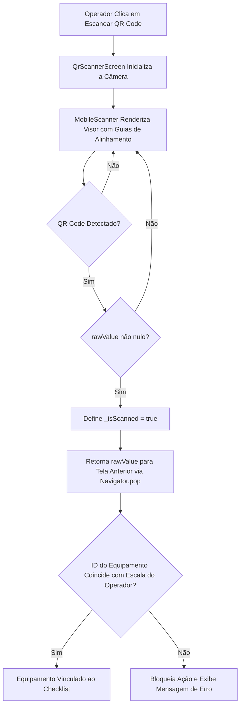

# Análise de Código e Arquitetura Móvel: Gestão de Equipamentos Pesados e Conformidade Industrial

Este documento analisa em detalhes a arquitetura e os componentes cruciais de implementação do módulo móvel da plataforma, desenvolvido em Flutter. O foco desta documentação é subsidiar artigos científicos e relatórios acadêmicos que discutam soluções móveis aplicadas à indústria pesada sob condições adversas de conectividade e rigidez de conformidade com normas regulamentadoras de segurança (NRs).

Serão analisadas a seguir três das implementações técnicas mais relevantes no código do Mobile:
1. **Mecanismo de Persistência e Sincronização Assíncrona (*Offline-First*)**
2. **Sistema de Rastreabilidade e Validação de Presença via QR Code**
3. **Painel de Captura de Assinatura Digital e Validação de Conformidade Operacional**

---

## 1. Persistência Local e Sincronização Assíncrona (*Offline-First*)

### Descrição e Contexto Técnico
Em operações industriais com equipamentos pesados (mineração, infraestrutura rodo-ferroviária, canteiros remotos), a conectividade com redes celulares (3G/4G/5G) ou redes Wi-Fi é altamente intermitente ou inexistente. Para garantir que o operador realize e registre o checklist diário de inspeção obrigatório sem depender de sinal de internet ativa, foi arquitetado um motor de sincronização local resiliente.

Esta funcionalidade é implementada combinando três blocos fundamentais:
* **Hive (`hive_flutter`)**: Um banco de dados NoSQL embarcado de alto desempenho, que atua gravando chaves-valores diretamente em disco em formato binário (*boxes*), provendo tempos de leitura e escrita da ordem de milissegundos.
* **Connectivity Plus (`connectivity_plus`)**: Uma biblioteca que escuta eventos do barramento nativo do sistema operacional móvel para registrar e propagar alterações de estado da interface de rede (Wi-Fi, dados móveis ou ausência total).
* **Provider Pattern (`provider`)**: Framework de gerenciamento de estado e injeção de dependência que orquestra a lógica de negócio de sincronização automática (*Background Sync Queue*).

### Funcionamento Lógico (Fluxo de Sincronização)

O fluxo de sincronização ocorre da seguinte forma:


### Trecho de Código Comentado

#### Persistência com Hive - `lib/services/local_database_service.dart`
O serviço encapsula as operações de fila local com o Hive, permitindo adicionar, recuperar e deletar registros de forma atômica utilizando o identificador único da caixa de dados (`checklists_sync_queue`):

```dart
class LocalDatabaseService {
  // Nome da caixa (box) usada para enfileirar checklists offline
  static const String checklistQueueBox = 'checklists_sync_queue';

  // Adiciona um checklist serializado ao final da fila local
  Future<void> addToQueue(String boxName, dynamic item) async {
    final box = Hive.box(boxName);
    await box.add(item);
  }

  // Recupera todos os checklists pendentes de sincronização
  List<dynamic> getQueue(String boxName) {
    final box = Hive.box(boxName);
    return box.values.toList();
  }

  // Remove o checklist da fila após sucesso no upload
  Future<void> removeFromQueue(String boxName, int index) async {
    final box = Hive.box(boxName);
    await box.deleteAt(index);
  }
}
```

#### Monitoramento de Conectividade - `lib/services/connectivity_service.dart`
O serviço escuta ativamente o canal de eventos de conectividade do sistema e expõe um `Stream` reativo:

```dart
class ConnectivityService {
  final Connectivity _connectivity = Connectivity();
  final StreamController<bool> _connectivityStreamController = StreamController<bool>.broadcast();

  ConnectivityService() {
    // Escuta as alterações na lista de conectividades do dispositivo (connectivity_plus 6.x)
    _connectivity.onConnectivityChanged.listen((List<ConnectivityResult> results) {
      _connectivityStreamController.add(_hasConnection(results));
    });
  }

  Stream<bool> get connectivityStream => _connectivityStreamController.stream;

  bool _hasConnection(List<ConnectivityResult> results) {
    if (results.isEmpty) return false;
    // Retorna true se houver qualquer canal ativo diferente de 'none'
    return results.any((result) => result != ConnectivityResult.none);
  }
}
```

#### Orquestração de Envio e Sincronização - `lib/providers/checklist_provider.dart`
O `ChecklistProvider` escuta as mudanças de rede iniciadas no construtor. Se o estado de rede alterar para ativo (`isOnline = true`), ele automaticamente dispara a rotina de esvaziamento da fila local:

```dart
class ChecklistProvider with ChangeNotifier {
  final ApiService _apiService = ApiService();
  final LocalDatabaseService _localDb = LocalDatabaseService();
  final ConnectivityService _connectivity = ConnectivityService();

  ChecklistProvider() {
    // Registra listener no Stream de conectividade
    _connectivity.connectivityStream.listen((isOnline) {
      if (isOnline) {
        syncPendingChecklists();
      }
    });
  }

  Future<Map<String, dynamic>> submitChecklist(Map<String, dynamic> data) async {
    _isLoading = true;
    notifyListeners();

    final bool isOnline = await _connectivity.isConnected;

    if (isOnline) {
      try {
        final response = await _apiService.post('/checklists', data);
        _isLoading = false;
        notifyListeners();
        
        if (response.statusCode == 201 || response.statusCode == 200) {
          return {'success': true, 'message': 'Checklist enviado com sucesso!'};
        } else {
          final responseData = jsonDecode(response.body);
          return {'success': false, 'message': responseData['message'] ?? 'Erro'};
        }
      } catch (e) {
        // Fallback: Se falhar mesmo reportando online (ex: timeout de gateway)
        await _queueChecklist(data);
        _isLoading = false;
        notifyListeners();
        return {'success': true, 'message': 'Salvo localmente (erro de rede).'};
      }
    } else {
      // Dispositivo offline: adiciona à fila Hive local
      await _queueChecklist(data);
      _isLoading = false;
      notifyListeners();
      return {'success': true, 'message': 'Checklist salvo localmente (offline).'};
    }
  }

  // Executa o processamento sequencial da fila acumulada no Hive
  Future<void> syncPendingChecklists() async {
    final List<dynamic> queue = _localDb.getQueue(LocalDatabaseService.checklistQueueBox);
    if (queue.isEmpty) return;

    for (int i = 0; i < queue.length; i++) {
      final item = Map<String, dynamic>.from(queue[i]);
      try {
        final response = await _apiService.post('/checklists', item);
        if (response.statusCode == 201 || response.statusCode == 200) {
          // Remove do Hive no índice exato
          await _localDb.removeFromQueue(LocalDatabaseService.checklistQueueBox, i);
        } else {
          break; // Preserva na fila para evitar perda caso o erro seja na rede
        }
      } catch (e) {
        break; // Interrompe em caso de nova instabilidade de conexão
      }
    }
  }
}
```

---

## 2. Sistema de Rastreabilidade e Validação de Presença via QR Code

### Descrição e Contexto Técnico
Um problema comum em sistemas de auditoria de segurança industrial é o preenchimento de formulários e checklists operacionais fora do local de trabalho (conhecido na literatura de segurança do trabalho como *registro nominal retrospectivo ou fraudulento*). Para atenuar esse risco e garantir a **presença física obrigatória do operador na cabine do equipamento**, o sistema exige a leitura ótica de uma etiqueta QR Code fixada no painel ou na estrutura externa da máquina.

A biblioteca utilizada para esta funcionalidade é a **`mobile_scanner`** (v7.2.0), que atua capturando os quadros de vídeo nativos da câmera do aparelho através de APIs do Android Camera2 e iOS AVFoundation, aplicando algoritmos de visão computacional de alta velocidade para localizar e decodificar dados em formato de matriz bidimensional (QR Codes).

### Funcionamento Lógico (Fluxo de Leitura e Validação)

O fluxo consiste em uma tela dedicada à captura ótica que impede cliques ou atalhos alternativos para a seleção de equipamento:



1. O operador clica no botão "Escanear QR Code" na interface móvel.
2. A tela `QrScannerScreen` inicializa a câmera e renderiza um visor central com guias visuais de alinhamento.
3. Ao decodificar um QR Code válido contendo a string de identificação do equipamento (por exemplo, `https://ribas.com/eq/65fd8a9b23b8f2`), o listener do `MobileScanner` intercepta a informação.
4. O valor lido é filtrado e retornado para a tela anterior para validação no backend/banco de dados local, bloqueando ações adicionais do aplicativo caso o ID da máquina não coincida com a escala do operador.

### Trecho de Código Comentado

#### Interface do Scanner - `lib/screens/scanner/qr_scanner_screen.dart`
A tela gerencia o sensor por meio do ciclo de vida do StatefulWidget e encerra a leitura assim que o primeiro token válido é obtido, prevenindo múltiplas leituras em lote:

```dart
class QrScannerScreen extends StatefulWidget {
  const QrScannerScreen({super.key});

  @override
  State<QrScannerScreen> createState() => _QrScannerScreenState();
}

class _QrScannerScreenState extends State<QrScannerScreen> {
  // Controle para evitar chamadas duplicadas no pop da navegação
  bool _isScanned = false;

  @override
  Widget build(BuildContext context) {
    return Scaffold(
      appBar: AppBar(
        title: const Text('Escanear QR Code'),
        backgroundColor: Colors.black,
        foregroundColor: Colors.white,
      ),
      body: Stack(
        children: [
          // Componente principal de detecção ótica em tempo real
          MobileScanner(
            onDetect: (capture) {
              if (_isScanned) return;
              
              final List<Barcode> barcodes = capture.barcodes;
              for (final barcode in barcodes) {
                if (barcode.rawValue != null) {
                  setState(() {
                    _isScanned = true;
                  });
                  // Retorna o valor decodificado do QR Code para a pilha anterior
                  Navigator.of(context).pop(barcode.rawValue);
                  break;
                }
              }
            },
          ),
          // Máscara visual de enquadramento (Overlays e Retículo de mira)
          Center(
            child: Container(
              width: 250,
              height: 250,
              decoration: BoxDecoration(
                border: Border.all(color: Colors.white, width: 2),
                borderRadius: BorderRadius.circular(12),
              ),
            ),
          ),
          const Positioned(
            bottom: 80,
            left: 0,
            right: 0,
            child: Center(
              child: Text(
                'Aponte para o QR Code do equipamento',
                style: TextStyle(
                  color: Colors.white, 
                  fontSize: 16, 
                  fontWeight: FontWeight.bold
                ),
              ),
            ),
          ),
        ],
      ),
    );
  }
}
```

---

## 3. Captura de Assinatura Digital e Validação de Conformidade Operacional

### Descrição e Contexto Técnico
Para fins jurídicos e de auditoria de acidentes de trabalho, a assinatura digitalizada do operador na folha de conformidade pré-inspeção tem peso legal substancial. O aplicativo móvel implementa o registro vetorial da assinatura do operador, salvando a representação dos traços do desenho geométrico desenhados na tela capacitiva do smartphone.

Este recurso utiliza:
* **`signature` (v6.3.0)**: Biblioteca que captura dados de entrada tátil (*pointer events*), suaviza as curvas por algoritmos matemáticos Bezier e renderiza a entrada do usuário em tempo real sobre um painel vetorial (canvas).
* **Estrutura de Validação de Regras de Negócio**: Um validador semântico em nível de UI e de controlador que analisa se todos os itens de segurança obrigatórios foram vistoriados pelo operador e se a assinatura foi de fato preenchida. Se houver falha crítica (como um item essencial marcado como "Não Conforme"), a interface gera alertas ativos informando sobre o possível bloqueio do equipamento.

### Funcionamento Lógico
O comportamento de validação e submissão segue estas premissas:
1. O formulário gera uma lista dinâmica com 10 itens estruturais críticos (freios, trincas estruturais, dispositivos de segurança, nível de óleo, etc.).
2. O operador precisa responder individualmente a cada item ("Ok" ou "Não Conforme").
3. O operador realiza a assinatura de próprio punho no painel capacitivo inferior.
4. Ao clicar em "Finalizar e Enviar Checklist", o sistema verifica o estado do `SignatureController`. Se estiver vazio (`_signatureController.isEmpty`), a submissão é bloqueada.
5. O sistema valida se houve marcação de itens "Não Conforme" (`status == 'not_ok'`). Em caso positivo, é gerado um aviso dinâmico informando que a máquina poderá ser bloqueada no sistema web admin, impedindo que o operador inicie qualquer ordem de serviço vinculada a ela.

### Trecho de Código Comentado

#### Implementação de Validação de Inspeção e Assinatura - `lib/screens/checklist/checklist_screen.dart`
Abaixo estão os trechos referentes à declaração do controlador, ao método de submissão com testes lógicos de integridade e à renderização do painel vetorial de desenho:

```dart
// Instanciação do controlador vetorial de assinatura capacitiva
final SignatureController _signatureController = SignatureController(
  penStrokeWidth: 3,
  penColor: Colors.black,
  exportBackgroundColor: Colors.white,
);

// Método executado no clique do botão de submissão do checklist
void _submit() async {
  // Regra de Negócio: Impede envio sem vinculação de equipamento
  if (_currentEquipment == null) {
    ScaffoldMessenger.of(context).showSnackBar(
      const SnackBar(content: Text('Selecione um veículo'))
    );
    return;
  }

  // Regra de Negócio: Valida a assinatura (não pode estar em branco)
  if (_signatureController.isEmpty) {
    ScaffoldMessenger.of(context).showSnackBar(
      const SnackBar(content: Text('Por favor, assine o checklist'))
    );
    return;
  }

  final apiService = ApiService();
  
  // Exibição do indicador visual de processamento de rede
  showDialog(
    context: context,
    barrierDismissible: false,
    builder: (ctx) => const Center(child: CircularProgressIndicator()),
  );

  try {
    final List<Map<String, dynamic>> itemsToSubmit = [];
    
    // Processamento de imagens capturadas via câmera para evidência de falha
    for (var item in _checkItems) {
      String? photoUrl;
      if (item['photo'] != null) {
        photoUrl = await apiService.uploadImage(item['photo']);
      }
      
      itemsToSubmit.add({
        'label': item['label'],
        'status': item['status'],
        'observation': item['controller'].text,
        'photoUrl': photoUrl,
      });
    }

    // Submissão do Payload agregador de estado operacional
    final result = await Provider.of<ChecklistProvider>(context, listen: false)
      .submitChecklist({
        'equipment': _currentEquipment!.id,
        'items': itemsToSubmit,
        'notes': _notesController.text,
        // O equipamento é marcado como reprovado no checklist se algum item falhou
        'isApproved': _checkItems.every((i) => i['status'] != 'not_ok'),
      });

    if (mounted) {
      Navigator.of(context).pop(); // Encerra o spinner de progresso
      // Trata o sucesso redirecionando para a Dashboard do Operador
    }
  } catch (e) {
    // Trata falha crítica na serialização ou envio dos dados
  }
}
```

#### Renderização Visual do Painel de Assinatura e Alertas - `lib/screens/checklist/checklist_screen.dart`
Este trecho de código constrói os elementos gráficos da UI que gerenciam a interação do usuário com a assinatura e exibem o alerta de não-conformidade dinamicamente:

```dart
// Widget correspondente à seção de assinatura
const Text(
  'Assinatura do Operador', 
  style: TextStyle(fontWeight: FontWeight.bold, color: Color(0xFF1A1A1A))
),
const SizedBox(height: 8),
Container(
  decoration: BoxDecoration(
    border: Border.all(color: const Color(0xFFE0E0E0)),
    borderRadius: BorderRadius.circular(4),
  ),
  child: Signature(
    controller: _signatureController,
    height: 150,
    backgroundColor: Colors.white,
  ),
),
Row(
  mainAxisAlignment: MainAxisAlignment.end,
  children: [
    TextButton(
      onPressed: () => _signatureController.clear(),
      child: const Text(
        'Limpar Assinatura', 
        style: TextStyle(color: Colors.redAccent, fontSize: 12)
      ),
    ),
  ],
),
const SizedBox(height: 24),

// Alerta de Bloqueio por Falha Crítica (Renderizado condicionalmente)
if (_checkItems.any((i) => i['status'] == 'not_ok')) ...[
  Container(
    padding: const EdgeInsets.all(12),
    decoration: BoxDecoration(
      color: Colors.red.shade50,
      border: Border.all(color: Colors.red.shade200),
      borderRadius: BorderRadius.circular(4),
    ),
    child: Row(
      children: [
        const Icon(Icons.warning_amber_rounded, color: Colors.red),
        const SizedBox(width: 12),
        Expanded(
          child: Column(
            crossAxisAlignment: CrossAxisAlignment.start,
            children: [
              const Text(
                'Atenção!', 
                style: TextStyle(fontWeight: FontWeight.bold, color: Colors.red)
              ),
              Text(
                'Existem itens não conformes. O equipamento poderá ser bloqueado para uso.',
                style: TextStyle(color: Colors.red.shade700, fontSize: 12),
              ),
            ],
          ),
        ),
      ],
    ),
  ),
  const SizedBox(height: 24),
],
```

---

## Conclusão da Análise Científica

A arquitetura móvel analisada demonstra uma abordagem coesa e tecnicamente fundamentada para três desafios contemporâneos em sistemas embarcados voltados à indústria pesada.

O primeiro desafio — a **resiliência a falhas de comunicação** — é endereçado pelo desacoplamento entre o envio HTTP e a persistência local. A fila assíncrona baseada em Hive atua como um buffer resiliente que preserva a integridade dos dados operacionais mesmo em ambientes com cobertura celular degradada ou inexistente, como canteiros remotos e zonas de sombra de sinal. Esse padrão *offline-first* é especialmente relevante em contextos onde a perda de um registro de inspeção pode ter implicações legais e de segurança.

O segundo desafio — a **rastreabilidade e prevenção de registros fraudulentos** — é mitigado pela exigência da leitura ótica do QR Code fixado fisicamente no equipamento. Ao forçar a proximidade física do operador com a máquina no momento do início da inspeção, o sistema cria uma âncora espacial verificável que reduz o risco de registros nominais retrospectivos, atribuindo responsabilidade civil ao agente operacional de forma rastreável e auditável.

O terceiro desafio — a **conformidade legal e operacional** — é tratado pela combinação entre a captura vetorial de assinatura e as regras de validação semântica aplicadas antes da submissão. A exigência de assinatura manuscrita digitalizada, em conjunto com o bloqueio automático de equipamentos com itens não conformes, cria um fluxo de auditoria aderente às exigências das Normas Regulamentadoras brasileiras (NRs), com potencial de uso como evidência documental em processos de fiscalização trabalhista ou investigação de acidentes.

Em conjunto, os três módulos formam uma solução integrada que equilibra usabilidade em campo — onde o operador frequentemente trabalha sob pressão de tempo e condições adversas — com os requisitos de rastreabilidade, integridade de dados e conformidade normativa exigidos pela indústria pesada brasileira.
